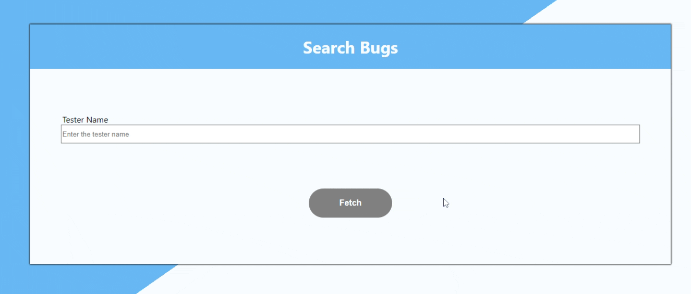

<p align="center">
  <h3 align="center">Search Bugs</h3>
  <p align="center">TechSee test - Search tester by name and show testers list.</p>
</p>


  <summary><h2 style="display: inline-block">Content</h2></summary>
  <ol>
    <li>
      <a href="#about-the-project">About The Project</a>
      <ul>
        <li><a href="#built-with">Built With</a></li>
      </ul>
    </li>
    <li>
      <a href="#getting-started">Getting Started</a>
      <ul>
        <li><a href="#installation">Installation</a></li>
      </ul>
    </li>
    <li><a href="#File">File Hierarchy</a></li>
    <li><a href="#acknowledgements">Acknowledgements</a></li>
      <li><a href="#features">Main Features</a></li>
  </ol>


<!-- ABOUT THE PROJECT -->
## About The Project


TechSee test - Search tester by name and show testers list.

### Built With

* [React](https://reactjs.org/)
* [node.js - express](https://expressjs.com/) (for proxy server)
* [axios](https://www.npmjs.com/package/axios)
* [enzyme](https://enzymejs.github.io/enzyme/) (for testing)

## Getting Started
To get a local copy up and running follow these simple steps.


### Installation

1. Clone the repo
   ```sh
   git clone https://github.com/tomeraitz/Search-Bugs.git
   ```
2. Install NPM packages
   ```sh
   npm install
   ```
3. Run Test
   ```sh
   npm test
   ```
4. Run the project
    ```sh
   npm start 
   ```
**Note!** The project Will run on localhost:3000, if you want to check if the proxy server is working open localhost:8000 (you will 'see Proxy Server Is Alive').

**Note!** If you enter `all` in the input and search it, it will show all the testers.

<!-- USAGE EXAMPLES -->
<h3 id="File">File Hierarchy</h3>

**proxy**
-  **proxyServer** -  the proxy server that handles the `cross-origin` issue.

**src**
-  **assets**
    - **styles**  - The main styles in use on all the components.
-  **components**
    - **Containers** - This project builds on the concept of `Containers and Presentational` patterns - the Containers will have the main functionalities.
        - **App** - The main component that rendered in the beginning. Here we can find the project routes.
        - **SearchTester** - The first page, the user can search a tester here.
        - **TestersList** - The Testers table
    - **Presentational** - All the simple components. You can see that all the components are function except **`Input`**. Although it has a `state` I still see it as `Presentational`, the `state` doesn't impact the app functionally like the container components.
-  **services**
    - **httpRequest.service** - Handles all the HTTP requests.
## Acknowledgements
* React (this project) and node.js (the proxy server) can run together with [concurrently](https://www.npmjs.com/package/concurrently)
* The Read me file was created with the template [Best-README-Template](https://github.com/othneildrew/Best-README-Template)


<h3 id="features">Main Features</h3>

- Responsive Design
- Error Input Handle
- Get Data From API
- Tests
- Disable User Controlling the Url
- Sort Data

